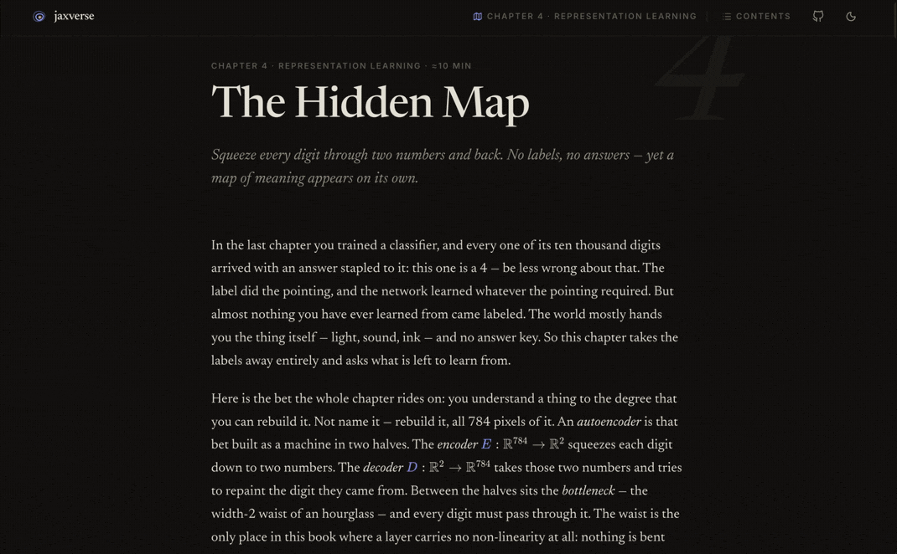

<p align="center">
  
</p>

# jaxverse

**A little universe of learning machines** — an interactive book about deep
learning where every model is real and trains live in your browser, from a
single neuron bending a line to a language model learning chess.

Built with [jax-js](https://jax-js.com) (JAX on WebGPU, in TypeScript),
SvelteKit, and Tailwind. Fully static; no server, no telemetry — every
gradient step happens on your own GPU.

## The descent

| #   | Chapter              | Paradigm                 | You train                                           |
| --- | -------------------- | ------------------------ | --------------------------------------------------- |
| 0   | The Descent          | Optimization             | five optimizers racing a loss landscape             |
| 1   | The Approximator     | Neural networks          | an MLP fitting curves you draw                      |
| 2   | Bending Space        | Representation           | a net untangling rings & spirals (the Colah homage) |
| 3   | Telling Things Apart | Supervised learning      | an MNIST classifier + saliency, confusion, weights  |
| 4   | The Hidden Map       | Representation learning  | an autoencoder with a 2-D latent you can walk       |
| 5   | The Next Token       | Self-supervised learning | a char-level transformer, sampling as it learns     |
| 6   | Learning from Reward | Reinforcement learning   | bandits + a policy-gradient gridworld               |
| 7   | Teaching Taste       | Preference learning      | a reward model from clicks, then Goodhart's law     |
| 8   | Rook                 | Everything at once       | a chess LM: pretraining → SFT → real RLVR           |
| 9   | Out of the Static    | Generative modelling     | a diffusion model drawing emoji out of noise        |
| 10  | The Straight Path    | Flow matching            | rectified flow, prompts, and combined emoji         |

## Develop

```sh
npm install
npm run dev
```

Chapters 5, 8, 9 and 10 train transformers and need WebGPU (Chrome/Edge on
desktop). Chapters 0–4, 6 and 7 run anywhere (jax-js falls back to CPU for the
small nets).

Datasets in `static/data/` are generated by `scripts/` (`build-mnist.mjs`,
`build-corpus.mjs`, `copy-rook-data.mjs`, `build-chess-sft.mjs`,
`build-emoji.mjs`) and committed, so a fresh clone builds without downloading
anything. The two diffusion checkpoints are trained by `train-emoji.mjs`, which
drives the real browser trainer in headless Chromium — the weights the book
ships come out of the same code a reader runs.

## Deploy (GitHub Pages)

The workflow in `.github/workflows/deploy.yml` builds with
`BASE_PATH=/<repo-name>` and publishes to Pages on every push to `main`:

1. Create a GitHub repository and push this project to `main`.
2. In the repo settings → Pages, set **Source: GitHub Actions**.
3. Push. The site appears at `https://<user>.github.io/<repo-name>/`.

```sh
npm run build          # local build (no base path)
npm run preview        # serve it
npm run check && npm run lint && npm run test:unit
```

## Credits

The Prologue's landscapes descend from [Gradient Lab](https://gradientlab.ai);
Chapter 2 is an homage to Christopher Olah's
[Neural Networks, Manifolds, and Topology](https://colah.github.io/posts/2014-03-NN-Manifolds-Topology/);
the transformer worker and the chess corpus come from the sibling project
LLMVibes; the in-browser autodiff is [jax-js](https://github.com/ekzhang/jax-js).
Chapters 9 and 10 draw eight redistributable emoji sets — Noto, Twemoji,
OpenMoji, Fluent and Blobmoji — each credited in the epilogue.
